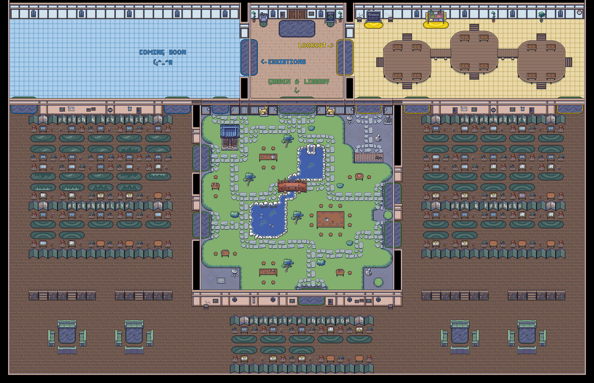

# Responsible Tech Library

This is a map built upon the starter kit for [WorkAdventure](https://workadventu.re) map making.



To understand how to use this starter kit, follow the tutorial at [https://workadventu.re/map-building](https://workadventu.re/map-building).

You can visit the Library at: https://play.workadventu.re/@/responsibletech.work/rtw/library

This map uses the [generateResourceLayers script](https://github.com/ResponsibleTechWork/generateResourceLayers) to auto-populate Library resources.

## Editing the map in Tiled

If you wish to visually edit the map, you'll need the [Tiled map editor](https://www.mapeditor.org/). The WorkAdventure [map building tutorial](https://workadventu.re/map-building/) provides additional info on how to add or edit WorkAdventure-specific properties and layers in Tiled.

A note if you're using the latest version of Tiled (1.9+): due to changes in the JSON schema, you'll likely encounter an [issue](https://github.com/thecodingmachine/workadventure-map-starter-kit/issues/39) with special area zones that play music or open websites. Currently, the easiest solution is to open the JSON map file within a Tiled project with v1.8 compatibility mode enabled. For this reason, the project file is also included in this repo. 

If you intend to edit the map in Tiled v1.9+, first open the project file `RespTechLibrary.tiled-project` in Tiled, and then open the `library.json` file. A `.tiled-session` file will also be created to help you resume work where you left it.

## Structure

* **tilesets** : All tilesets
* **public** : Static files
* **src** : All TypeScript/Javascript scripts
* **library.json** : Map file
* **library.png** : Image displayed on README.md and on the map infos in-game

If you want to use more than one map file, just add the new map file in the root folder, your tilesets in the assets folder and a new script if you need it in the src folder (it will be automaticaly optimized in production).

## Requirements

Node.js version >=16

## Installation

With npm installed (comes with [node](https://nodejs.org/en/)), run the following commands into a terminal in the root directory of this project:

```shell
npm install
npm run dev
```

## Test optimized map
You can test the optimized map as you do in production:
```sh
npm run build
npm run preview
```

## Licenses

This project contains multiple licenses as follows:

* [Code license](./LICENSE.code) *(all files except those for other licenses)*
* [Map license](./LICENSE.map) *(`library.json` and the map visual as well)*
* [Assets license](./LICENSE.assets) *(the files inside the `src/assets/` folder)*

### About third party assets

If you add third party assets in your map, do not forget to:
1. Credit the author and license with the "tilesetCopyright" property present in the properties of each tilesets in the `library.json` file
2. Add the license text in LICENSE.assets
